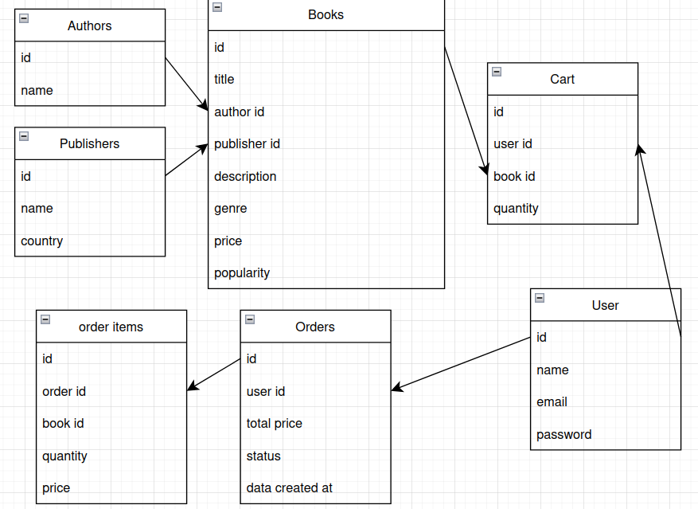

# Bookstore API
 **by Vysokovskykh Katerya**

## Description
This is bookstore website for user to buy books. Users can search, sort books by name, author, genre, publisher. Authenticated users can add books to their cart, place orders, and manage their profile.

---
## Endpoints

### Books

#### all books
- **Request**: ```GET /books```
- **Purpose**: Get list of all books, optionally filter and sort. 
- **Response status**: ```200```
- **Response body**: 
```
[
 {
    "id":1,
    "title":"The city",
    "author": "Valerian Pidmohylny",
    "publisher":"Ranok",
    "description": "The novel  is the story of..." ,
    "genre":"Urban Fiction",
    "price": 500,
    "popularity": 5
 },
    ...
]
```
#### specific book by id
- **Request**: ```GET /books/1```
- **Purpose**: Get full info about specific book
- **Response status**: ```200```<br>
(or ```404``` if not found)
- **Response body**: 
```
 {
    "id":1,
    "title":"The city",
    "author": "Valerian Pidmohylny",
    "publisher":"Ranok",
    "description": "The novel  is the story of..." ,
    "genre":"Urban Fiction",
    "price": 500,
    "popularity": 5
 }
```
 #### create book
 - **Request**: ```POST /books```
- **Purpose**: add new book to database
- **Response status**: ```201```
- **Request body**: 
```
{
    "title": "The city",
    "author_id": 1,
    "publisher_id": 1,
    "description": "The novel is the story of...",
    "genre":"Urban Fiction",
    "price": 500,
    "popularity": 5
}
```
- **Response body**:
```
 {
    "id":1,
    "title":"The city",
    "author": "Valerian Pidmohylny",
    "publisher":"Ranok",
    "description": "The novel  is the story of..." ,
    "genre":"Urban Fiction",
    "price": 500,
    "popularity": 5
 }
```
 ####  update book
 - **Request**: ```PUT /books/1```
- **Purpose**: update existing book
- **Response status**: ```200```
- **Request body**: 
```
 {
    "title":"The city",
    "author_id": 1,
    "publisher_id":"1,
    "description": "The novel  is the story of..." ,
    "genre":"Urban Fiction",
    "price": 400,
    "popularity": 10
 }
```
- **Response body**:
```
 {
    "id":1,
    "title":"The city",
    "author": "Valerian Pidmohylny",
    "publisher":"Ranok",
    "description": "The novel  is the story of..." ,
    "genre":"Urban Fiction",
    "price": 400,
    "popularity": 10
 }
```
 #### delete book by id
 - **Request**: ```DELETE /books/1```
- **Purpose**: delete book
- **Response status**: ```204```

---
### Authors

#### all authors
- **Request**: ```GET /authors```
- **Purpose**: Get list of all authors. 
- **Response status**: ```200```
- **Response body**: 
```
[
 {
    "id":1,
    "name": "Valerian Pidmohylny"
 },
    ...
]
```
#### specific author by id
- **Request**: ```GET /authors/1```
- **Purpose**: Get full info about a specific author, including all their books.
- **Response status**: ```200```<br>
(or ```404``` if not found)
- **Response body**: 
```
 {
    "id":1,
    "name": "Valerian Pidmohylny",
    "books":[
    {
        "id":1,
        "title":"The city",
        "publisher":"Ranok",
        "genre":"Urban Fiction",
        "price": 500,
        "popularity": 5
    },
    ...
    ]
 }
 ```
 #### create author
 - **Request**: ```POST /authors```
- **Purpose**: add new author
- **Response status**: ```201```
- **Request body**: 
```
{
    "name": "Valerian Pidmohylny"
}
```
- **Response body**:
```
 {
    "id":1,
    "name": "Valerian Pidmohylny"
 }
```

 ####  update author
 - **Request**: ```PUT /authors/1```
- **Purpose**: update an existing author's info.
- **Response status**: ```200```
- **Request body**: 
```
{
    "name": "Valerian Pidmohylny"
}
```
- **Response body**:
```
 {
    "id":1,
    "name": "Valerian Pidmohylny"
 }
```
 #### delete author by id
 - **Request**: ```DELETE /authors/1```
- **Purpose**: delete author
- **Response status**: ```204```
---
### Publishers
#### all publishers
- **Request**: ```GET /publishers```
- **Purpose**: Get list of all publishers. 
- **Response status**: ```200```
- **Response body**: 
```
[
 {
    "id":1,
    "name": "Ranok",
    "country": "Ukraine"
 },
    ...
]
```
#### specific publisher by id
- **Request**: ```GET /publishers/1```
- **Purpose**: Get full info about a specific publisher, including all their books.
- **Response status**: ```200```<br>
(or ```404``` if not found)
- **Response body**: 
```
 {
    "id": 1,
    "name": "Ranok",
    "country": "Ukraine",
    "books":[
    {
        "id":1,
        "title":"The city",
        "author": "Valerian Pidmohylny",
        "genre":"Urban Fiction",
        "price": 500,
        "popularity": 5
    },
    ...
    ]
 }
 ```
 #### create publisher
- **Request**: ```POST /publishers```
- **Purpose**: add new publisher
- **Response status**: ```201```
- **Request body**: 
```
{
    "name": "Ranok",
    "country": "Ukraine"
}
```
- **Response body**:
```
 {
    "id":1,
    "name": "Ranok",
    "country": "Ukraine"
 }
```

 ####  update publisher
- **Request**: ```PUT /publishers/1```
- **Purpose**: update an existing publisher's info.
- **Response status**: ```200```
- **Request body**: 
```
{
    "name": "Ranok",
    "country": "Ukraine"
}
```
- **Response body**:
```
 {
    "id":1,
    "name": "Ranok",
    "country": "Ukraine"
 } 
```
 #### delete publisher by id
- **Request**: ```DELETE /publishers/1```
- **Purpose**: delete publisher
- **Response status**: ```204```

---
### Users

#### register (create user)

- **Request**: ```POST /users/register```
- **Purpose**: register new user
- **Response status**: ```201```
- **Request body**: 
```
{
    "name": "User",
    "email": "user@gmail.com",
    "password": "****"
}
```
- **Response body**:
```
 {
    "id":1,
    "name": "User",
    "email": "user@gmail.com",
 }
```
#### login user
- **Request**: ```POST /users/login```
- **Purpose**: authenticate user
- **Response status**: ```200``` <br>
(or ```401``` if unauthorized)
- **Request body**: 
```
{
    "email": "user@gmail.com",
    "password": "****"
}
```
- **Response body**:
```
 {
    "id":1,
    "name": "User",
    "email": "user@gmail.com",
 }
```
#### get profile
- **Request**: ```GET /users/me```
- **Purpose**: get user`s info
- **Response status**: ```200```
- **Response body**:
```
 {
    "id":1,
    "name": "User",
    "email": "user@gmail.com",
    "orders": " /orders"
 }
```
---
### Cart

#### get user cart
- **Request**: ```GET /cart```
- **Purpose**: Get all books in user's cart. 
- **Response status**: ```200```
- **Response body**: 
```
[
 {
    "id":1,
    "book": {
      "id": 1,
      "title": "The city",
      "price": 500
   },
    "quantity": 2
 },
   ...
]
```

 #### add book to cart
- **Request**: ```POST /cart```
- **Purpose**: add a book to user's cart
- **Response status**: ```201```
- **Request body**: 
```
{
   "book_id": 1,
    "quantity": 1
}
```
- **Response body**:
```
{
   "id":1,
   "book": {
   "id": 1,
   "title": "The city",
   "price": 500
   },
   "quantity": 1
},
```
 ####  update cart
- **Request**: ```PATCH /cart/1```
- **Purpose**: change quantity of books in cart
- **Response status**: ```200```
- **Request body**: 
```
{
    "quantity": 3
}
```
- **Response body**:
```
{
   "id":1,
   "book": {
   "id": 1,
   "title": "The city",
   "price": 500
   },
   "quantity": 3
},
```
 #### delete cart item
- **Request**: ```DELETE /cart/1```
- **Purpose**: delete book
- **Response status**: ```204```

---
### Orders +Order_items

#### get all orders
- **Request**: ```GET /orders```
- **Purpose**: get all orders of the current user 
- **Response status**: ```200```
- **Response body**: 
```
[
  {
    "id": 1,
    "total_price": 1500,
    "date": "01.01.2025"
    "status": "completed"
  },
  {
    "id": 2,
    "total_price": 800,
    "date": "01.01.2025"
    "status": "completed"
  }
]

```
#### get order by id
- **Request**: ```GET /orders/1```
- **Purpose**: get details on  specific order 
- **Response status**: ```200```
- **Response body**: 
```
{
  "id": 1,
  "user_id": 1,
  "total_price": 1500,
  "date": "01.01.2025"
  "status": "completed"
  "items": [
    {
      "book_id": 1,
      "title": "The City",
      "quantity": 2,
      "price": 500
    },
   ...
  ]
}

```
 #### create order
- **Request**: ```POST /orders```
- **Purpose**:create a new order
- **Response status**: ```201```
- **Request body**: 
```
{
  "items": [
    {
      "book_id": 1,
      "quantity": 2
    },
    {
      "book_id": 5,
      "quantity": 1
    }
  ]
}

```
- **Response body**:
```
{
    "id": 1,
    "user_id": 1,
   "items": [
      {
         "book_id": 1,
         "title": "The City",
         "quantity": 2,
         "price": 500
      },
      {
         "book_id": 5,
         "title": "Forest Tales",
         "quantity": 1,
         "price": 500
      }
    ],
    "total_price": 1500,
    "date": "01.01.2025",
    "status": "pending"
}

```
---

## Data Base

